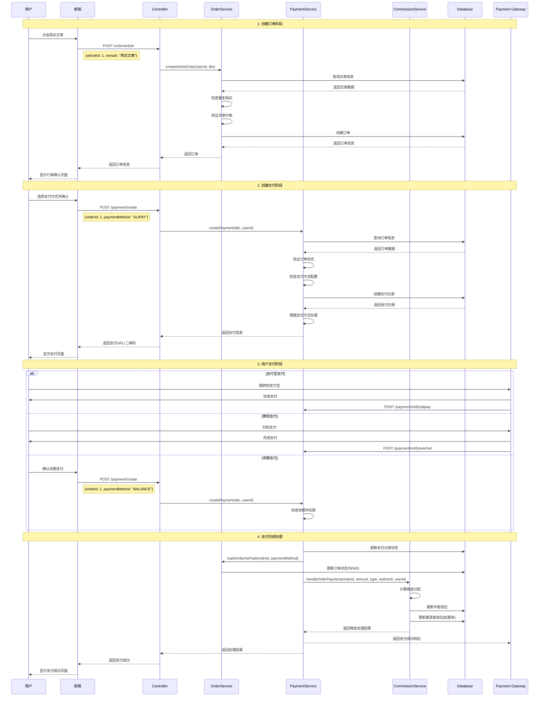
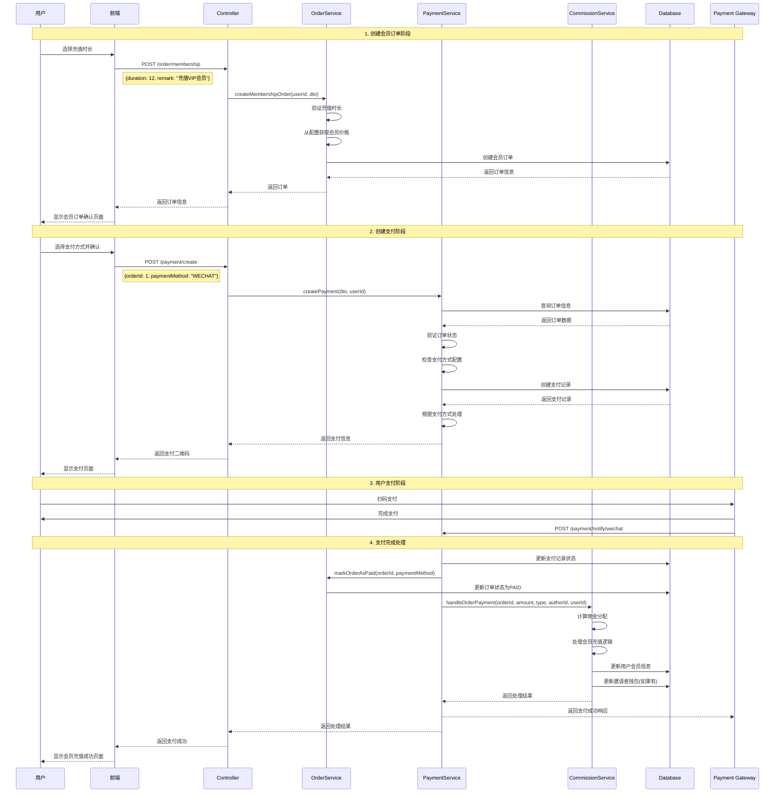
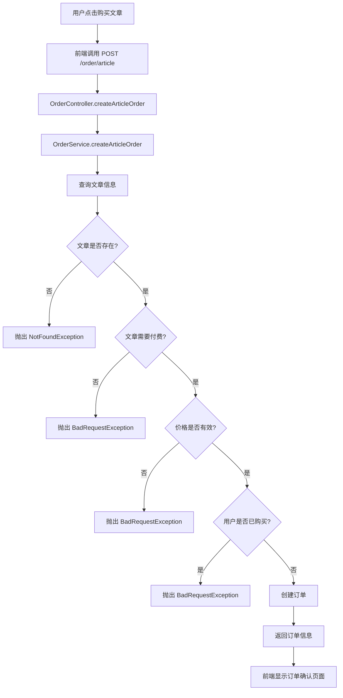
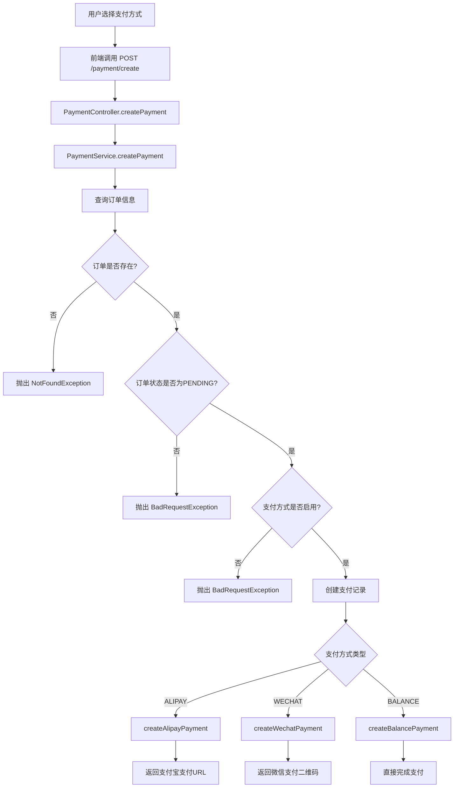
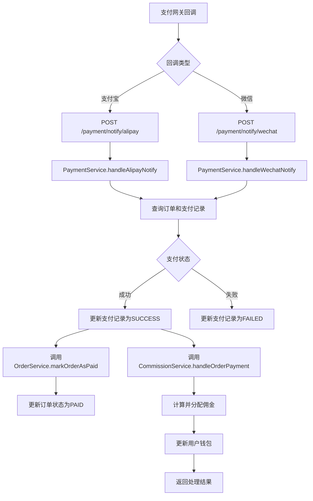
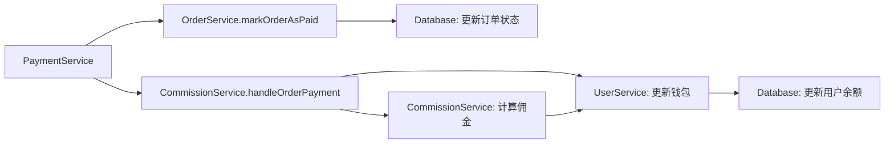
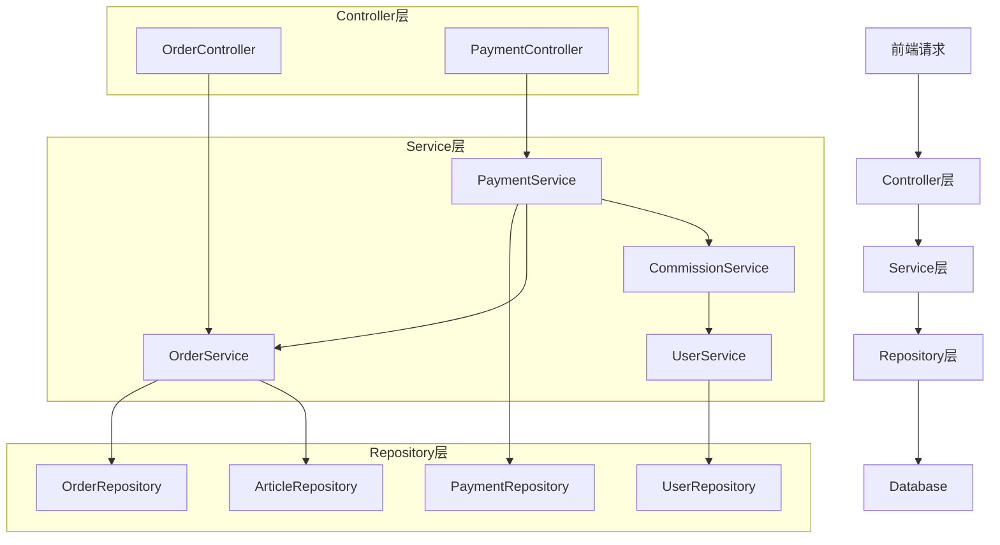
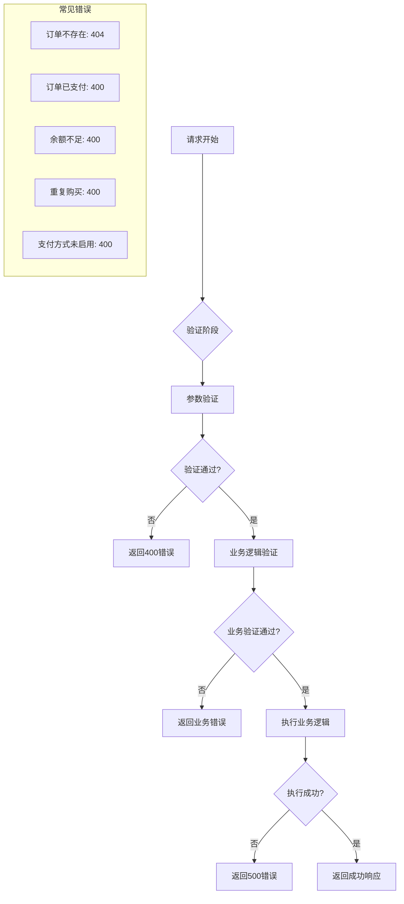
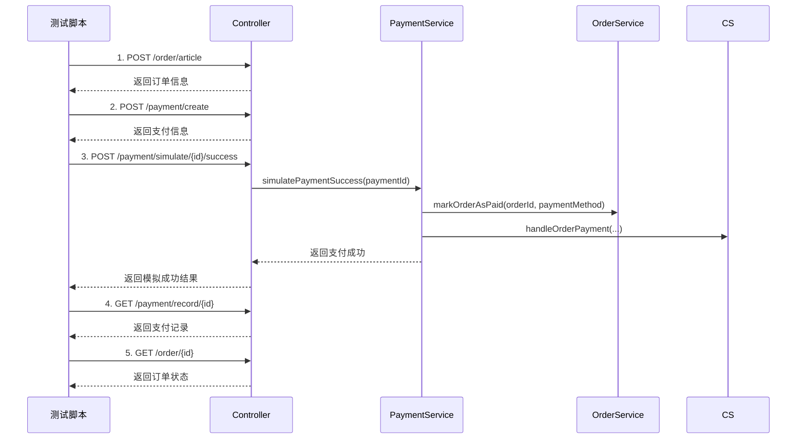
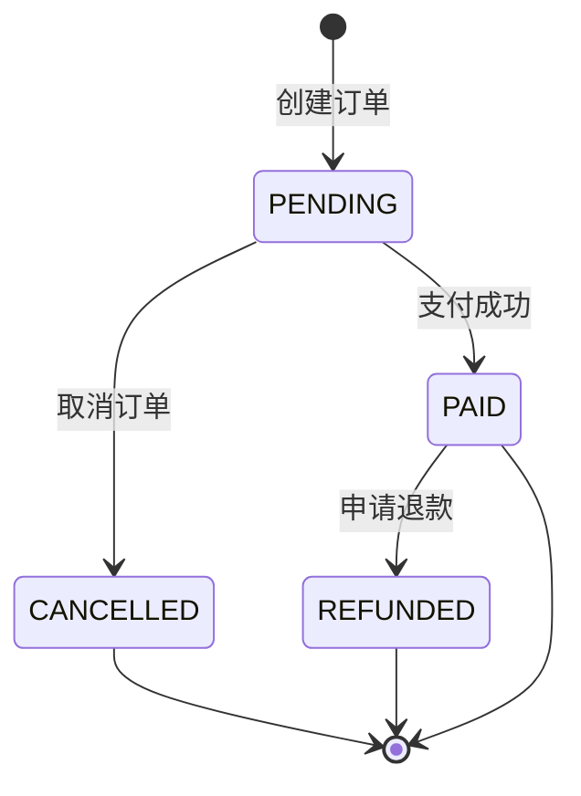

# 支付系统完整流程图

## 1. 文章购买支付流程

## 2. 会员充值支付流程

## 2. 详细接口调用流程

### 2.1 创建文章订单

**接口详情**:
- **URL**: `POST /order/article`
- **请求体**: `{articleId: number, remark?: string}`
- **响应**: 订单信息包含 `id`, `orderNo`, `amount`, `title` 等

### 2.2 创建支付

**接口详情**:
- **URL**: `POST /payment/create`
- **请求体**: `{orderId: number, paymentMethod: string, details?: string}`
- **响应**: 根据支付方式返回不同的支付信息

### 2.3 支付回调处理

**接口详情**:
- **支付宝回调**: `POST /payment/notify/alipay`
- **微信回调**: `POST /payment/notify/wechat`
- **请求体**: 支付网关的原始回调数据
- **响应**: `{success: true}`

## 3. 服务间调用关系

### 3.1 支付成功时的服务调用链

### 3.2 数据流向图

## 4. 错误处理流程

## 5. 测试流程

## 6. 关键接口总结

| 阶段 | 接口 | 方法 | 说明 |
|------|------|------|------|
| **订单创建** | `/order/article` | POST | 创建文章订单 |
| **支付创建** | `/payment/create` | POST | 创建支付记录 |
| **支付回调** | `/payment/notify/alipay` | POST | 支付宝回调处理 |
| **支付回调** | `/payment/notify/wechat` | POST | 微信回调处理 |
| **支付查询** | `/payment/record/{id}` | GET | 查询支付记录 |
| **订单查询** | `/order/{id}` | GET | 查询订单详情 |
| **模拟支付** | `/payment/simulate/{id}/success` | POST | 测试用支付成功 |
| **订单取消** | `/order/{id}/cancel` | PUT | 取消订单 |
| **申请退款** | `/order/{id}/refund` | POST | 申请退款 |

## 7. 状态流转图

这个流程图完整展示了从用户点击购买到支付完成的每个步骤，包括所有接口调用和服务间的协作关系。
