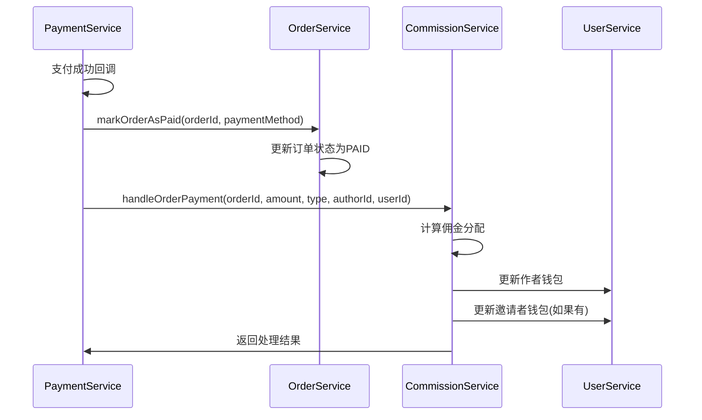
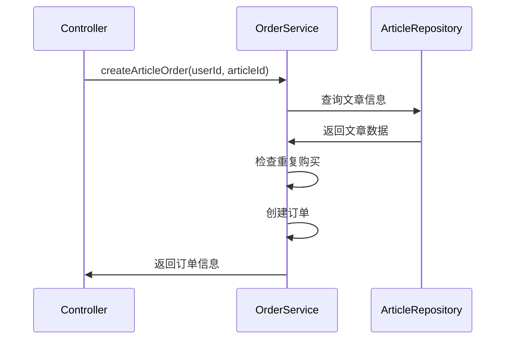

# 服务职责分工文档

## 概述

为了避免服务间的职责重复和冲突，我们明确划分了各个服务的职责范围。每个服务专注于自己的核心功能，通过明确的接口进行协作。

## 服务职责分工

### 1. OrderService (订单服务)

**核心职责**: 订单生命周期管理

**主要功能**:
- ✅ 创建订单 (`createOrder`, `createArticleOrder`)
- ✅ 查询订单 (`findOne`, `findByOrderNo`, `getUserOrders`)
- ✅ 更新订单状态 (`updateOrderStatus`, `markOrderAsPaid`)
- ✅ 订单验证 (重复购买检查、文章存在性验证)
- ✅ 订单取消和退款 (`cancelOrder`, `requestRefund`)
- ✅ 生成订单号 (`generateOrderNo`)

**不负责**:
- ❌ 支付流程处理
- ❌ 佣金计算和分配
- ❌ 用户钱包操作

**对外接口**:
```typescript
// 订单服务提供的方法
class OrderService {
  createOrder(orderData: Partial<Order>): Promise<Order>
  createArticleOrder(userId: number, dto: CreateArticleOrderDto): Promise<Order>
  findOne(id: number): Promise<Order>
  markOrderAsPaid(orderId: number, paymentMethod: string): Promise<Order>
  updateOrderStatus(id: number, status: string, paidAt?: Date): Promise<Order>
  cancelOrder(orderId: number, userId: number): Promise<Order>
  requestRefund(orderId: number, userId: number, reason: string): Promise<Order>
}
```

### 2. PaymentService (支付服务)

**核心职责**: 支付流程处理

**主要功能**:
- ✅ 创建支付记录 (`createPayment`)
- ✅ 处理不同支付方式 (支付宝、微信、余额)
- ✅ 支付回调处理 (`handleAlipayNotify`, `handleWechatNotify`)
- ✅ 支付状态管理
- ✅ 支付记录查询
- ✅ 模拟支付 (测试用)

**不负责**:
- ❌ 订单创建和管理
- ❌ 佣金计算和分配
- ❌ 用户钱包直接操作

**对外接口**:
```typescript
// 支付服务提供的方法
class PaymentService {
  createPayment(dto: CreatePaymentDto, userId: number): Promise<PaymentResult>
  handleAlipayNotify(notifyData: AlipayNotifyDto): Promise<any>
  handleWechatNotify(notifyData: WechatNotifyDto): Promise<any>
  findPaymentRecord(id: number): Promise<PaymentRecord>
  simulatePaymentSuccess(paymentId: number): Promise<any>
}
```

### 3. CommissionService (佣金服务)

**核心职责**: 佣金计算和分配

**主要功能**:
- ✅ 佣金计算 (`calculateCommission`)
- ✅ 订单支付后的佣金分配 (`handleOrderPayment`)
- ✅ 邀请佣金处理 (`handleInviteCommission`)
- ✅ 用户钱包更新

**不负责**:
- ❌ 订单管理
- ❌ 支付流程
- ❌ 用户信息管理

**对外接口**:
```typescript
// 佣金服务提供的方法
class CommissionService {
  calculateCommission(authorId: number, amount: number, type: string): Promise<CommissionResult>
  handleOrderPayment(orderId: number, amount: number, type: string, authorId: number, userId: number): Promise<PaymentResult>
  handleInviteCommission(userId: number, amount: number, inviterAmount: number): Promise<any>
}
```

### 4. UserService (用户服务)

**核心职责**: 用户信息管理

**主要功能**:
- ✅ 用户信息查询和更新
- ✅ 用户认证相关
- ✅ 用户基础信息管理

**不负责**:
- ❌ 订单管理
- ❌ 支付处理
- ❌ 佣金计算

### 5. ConfigService (配置服务)

**核心职责**: 系统配置管理

**主要功能**:
- ✅ 支付配置管理
- ✅ 佣金配置管理
- ✅ 系统参数配置

## 服务协作流程

### 支付完成流程



### 创建文章订单流程



## 数据流向

### 订单数据流
1. **创建**: Controller → OrderService → Database
2. **查询**: Controller → OrderService → Database
3. **更新**: PaymentService → OrderService → Database

### 支付数据流
1. **创建**: Controller → PaymentService → Database
2. **回调**: Payment Gateway → PaymentService → OrderService + CommissionService
3. **查询**: Controller → PaymentService → Database

### 佣金数据流
1. **计算**: PaymentService → CommissionService → UserService
2. **分配**: CommissionService → UserService → Database

## 错误处理

### 职责边界
- **订单相关错误**: 由 OrderService 抛出
- **支付相关错误**: 由 PaymentService 抛出
- **佣金相关错误**: 由 CommissionService 抛出
- **用户相关错误**: 由 UserService 抛出

### 错误传播
- 服务间调用时，错误会向上传播
- Controller 层负责错误格式化和响应
- 每个服务只处理自己职责范围内的错误

## 扩展原则

### 添加新功能时
1. **明确职责**: 新功能属于哪个服务的职责范围
2. **避免重复**: 不要在不同服务中实现相同功能
3. **接口设计**: 通过明确的接口进行服务间通信
4. **依赖注入**: 使用依赖注入管理服务间依赖

### 修改现有功能时
1. **职责检查**: 确认修改是否在服务职责范围内
2. **影响评估**: 评估对其他服务的影响
3. **接口兼容**: 保持对外接口的兼容性
4. **测试覆盖**: 确保修改后的功能有足够的测试覆盖

## 最佳实践

1. **单一职责**: 每个服务只负责一个明确的业务领域
2. **接口隔离**: 通过明确的接口进行服务间通信
3. **依赖倒置**: 依赖抽象而不是具体实现
4. **错误边界**: 每个服务处理自己职责范围内的错误
5. **数据一致性**: 通过事务确保跨服务操作的数据一致性
