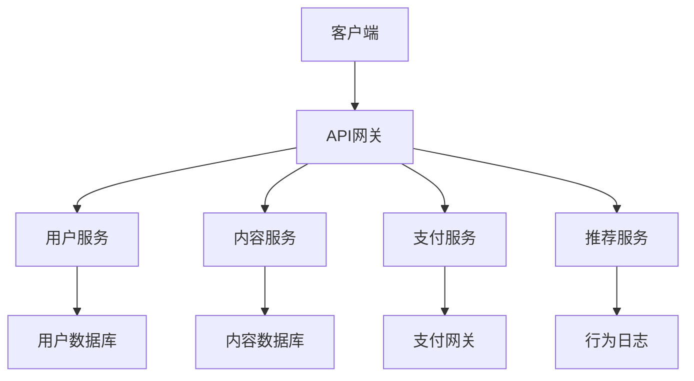
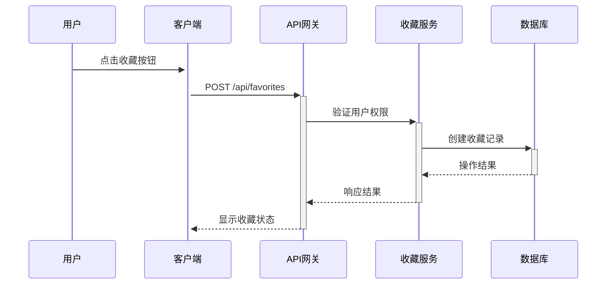
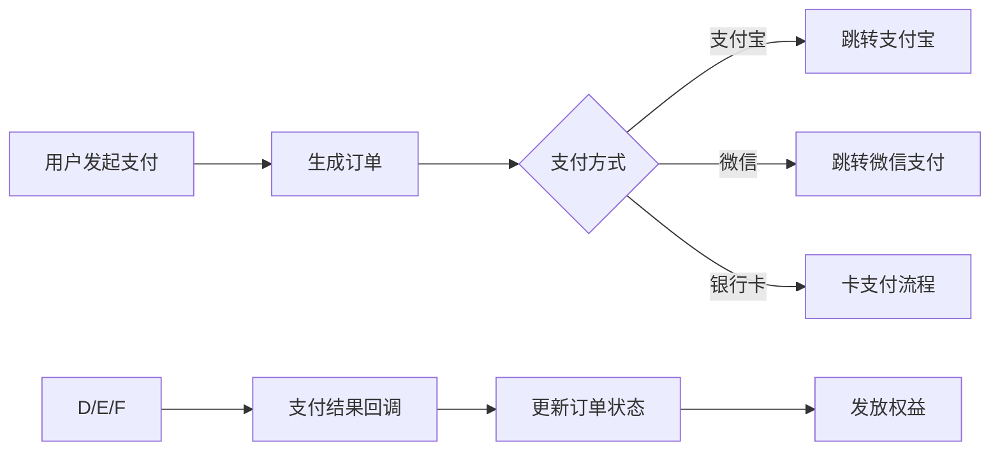
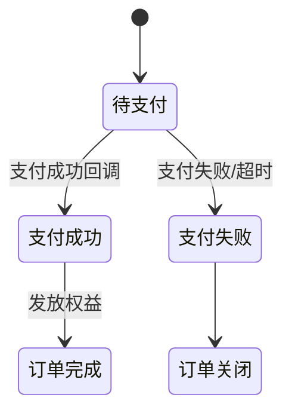
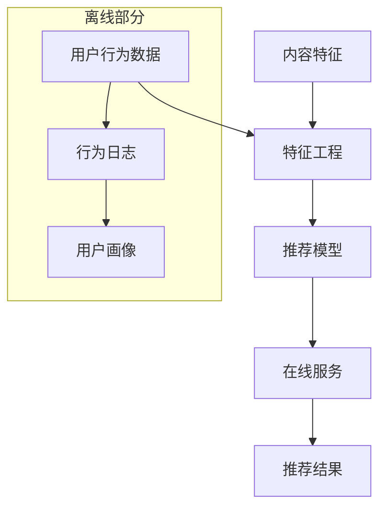

# 内容社区功能扩展设计方案

## 目录

- [内容社区功能扩展设计方案](#内容社区功能扩展设计方案)
  - [目录](#目录)
  - [功能概述](#功能概述)
  - [系统架构](#系统架构)
  - [文章收藏功能](#文章收藏功能)
    - [功能流程](#功能流程)
    - [数据结构](#数据结构)
  - [支付对接功能](#支付对接功能)
    - [支付流程](#支付流程)
    - [支付状态机](#支付状态机)
  - [推荐算法](#推荐算法)
    - [推荐系统架构](#推荐系统架构)
    - [混合推荐策略](#混合推荐策略)
  - [数据存储设计](#数据存储设计)
    - [主要数据表](#主要数据表)
  - [接口设计](#接口设计)
    - [主要API端点](#主要api端点)
  - [安全考虑](#安全考虑)

## 功能概述

为内容社区平台新增三个核心功能：

- 用户文章收藏系统
- 支付对接（支持会员订阅/内容付费）
- 个性化推荐算法

## 系统架构



## 文章收藏功能

### 功能流程



### 数据结构

```json
{
  "favorite_id": "uuid",
  "user_id": "uuid",
  "article_id": "uuid",
  "created_at": "timestamp",
  "tags": ["标签1", "标签2"]
}
```

## 支付对接功能

### 支付流程



### 支付状态机



## 推荐算法

### 推荐系统架构



### 混合推荐策略

1. **协同过滤**：基于用户收藏/浏览历史
2. **内容相似度**：TF-IDF + 余弦相似度
3. **热门内容**：近期热门文章
4. **加权公式**：

   ```math
   最终得分 = 0.4*协同过滤 + 0.3*内容相似度 + 0.2*热门度 + 0.1*随机探索
   ```

## 数据存储设计

### 主要数据表

| 表名 | 字段 | 说明 |
|------|------|------|
| user_favorites | user_id, article_id, create_time | 收藏关系表 |
| payment_orders | order_id, amount, status, payment_method | 支付订单表 |
| user_behavior | user_id, item_id, action_type, timestamp | 行为日志表 |

## 接口设计

### 主要API端点

1. `POST /api/favorites` - 添加收藏
2. `GET /api/favorites` - 获取用户收藏列表
3. `POST /api/payment/orders` - 创建支付订单
4. `GET /api/recommendations` - 获取推荐内容

## 安全考虑

1. 支付接口使用HTTPS + 签名验证
2. 敏感操作需要二次确认
3. 推荐系统加入差分隐私保护
4. 定期清理支付日志
